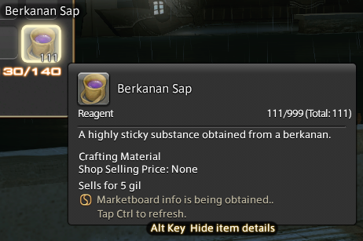

# FFXIV Price Insight

A price insight plugin for FFXIV Quick Launcher / Dalamud using the [Universalis API](https://universalis.app/)

Whenever you mouseover an item, it will show you the NQ/HQ marketboard prices at the bottom as well as the most recent purchase.

The marketboard info will not be immediately available, 
you can move your mouse or tap the ctrl key to refresh the tooltip.
Information will only be refreshed every 60 seconds.

## Installation

Available for install via [Dalamud](https://github.com/goatcorp/FFXIVQuickLauncher)'s built-in plugin installer.

Alternatively check https://github.com/Kouzukii/DalamudPlugins on how to install my plugins directly.
